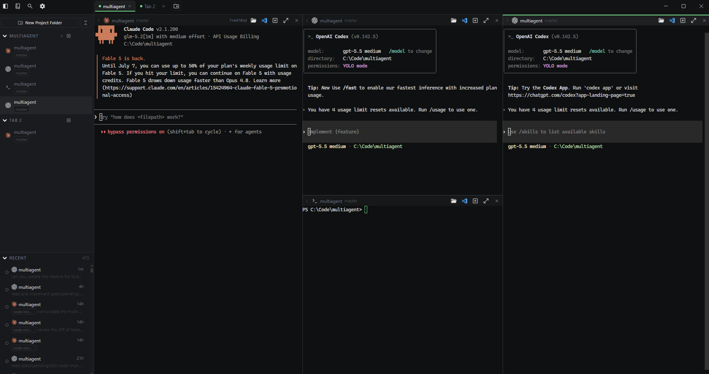
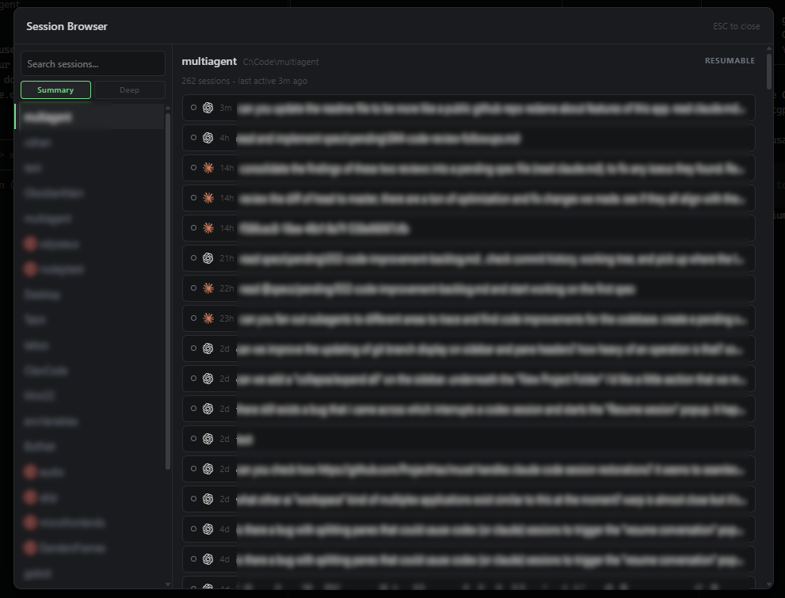
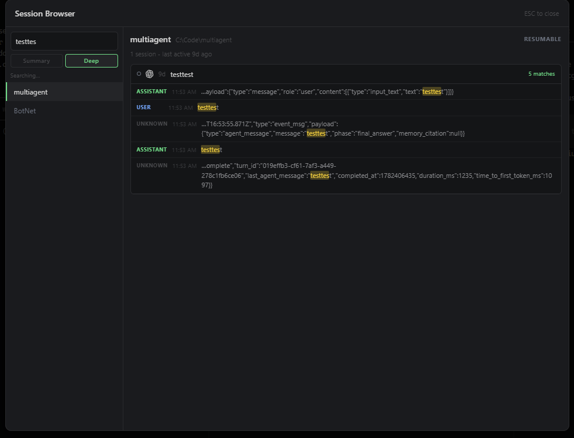
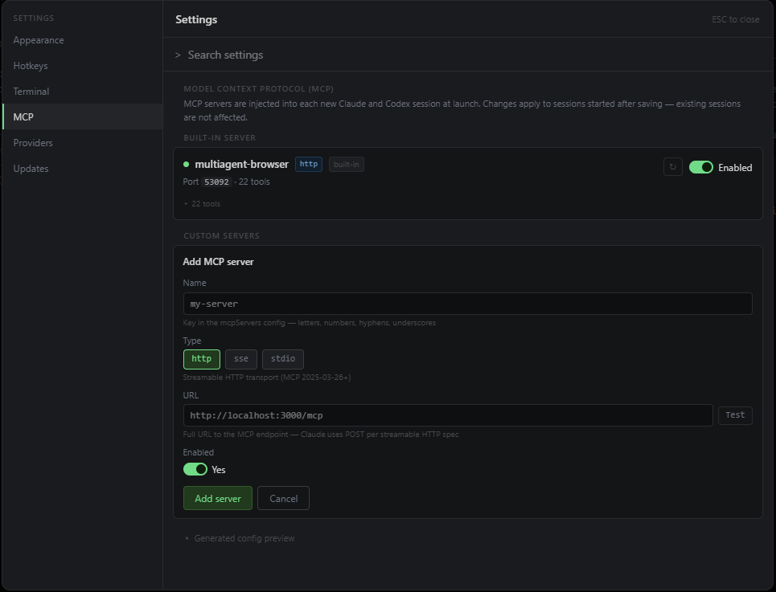

# MultiAgent

MultiAgent is a Windows desktop workspace for running Claude Code, Codex, and regular shell sessions side by side. It combines a tiling terminal, persistent project layouts, searchable agent history, and an embedded browser that agents can control through MCP.

> [!WARNING]
> MultiAgent is alpha software. Expect breaking changes and rough edges. Windows 10 and 11 are currently the only supported platforms.



## Why MultiAgent?

Agent CLIs work well independently, but real projects often need several sessions at once: one agent implementing, another reviewing, a shell running tests, and a browser verifying the result. MultiAgent keeps that work in one durable workspace instead of spreading it across terminal windows.

## Features

- **Claude Code and Codex in one app** — start either agent in any project directory and mix agent and PowerShell panes in the same tab.
- **Flexible tiling layouts** — split panes horizontally or vertically, resize and zoom them, reorder panes and tabs with drag and drop, or move work into a detached window.
- **Persistent workspaces** — tabs, pane trees, directories, sidebar state, and active sessions are restored when the app starts. Inactive tabs are loaded on demand.
- **Resume and search agent sessions** — browse recent Claude and Codex sessions, filter summaries instantly, or deep-search complete transcripts with literal, case-sensitive, and regex modes.
- **Recover moved projects** — repair a missing project directory and update the affected session and saved-layout paths together.
- **Agent-controlled browser** — open an embedded browser and expose navigation, inspection, interaction, screenshots, and JavaScript evaluation to agents through a process-scoped MCP server.
- **Command palette and keyboard workflow** — reach workspace actions from `Ctrl+Shift+P`, customize app shortcuts, and create terminal text macros.
- **Provider configuration** — use native Claude/Codex authentication or configure supported and custom Anthropic- or OpenAI-compatible endpoints per agent.
- **Terminal controls** — configure scrollback, rendering, GPU acceleration, contrast, glyph scaling, and terminal key bindings.
- **Project-aware tools** — open a pane in Explorer or VS Code, copy its path, switch among recent directories, and optionally display Git branch badges.
- **Automatic updates** — packaged builds can check GitHub Releases and install updates from inside the app.

### Session history

| Summary search | Deep transcript search |
| --- | --- |
|  |  |

## Requirements

| Requirement | Notes |
| --- | --- |
| Windows 10 or 11 | MultiAgent uses PowerShell, ConPTY, and Windows shell integration. macOS and Linux are not supported yet. |
| Node.js 24.x | Required for development builds and native Electron dependencies. The expected version is in `.nvmrc`. |
| Claude Code CLI | Required for Claude panes. Install `claude`, put it on `PATH`, and authenticate before launching MultiAgent. |
| Codex CLI | Required for Codex panes. Install `codex`, put it on `PATH`, and authenticate before launching MultiAgent. |
| Visual Studio Build Tools and Python | Usually unnecessary; only needed if npm cannot use prebuilt native modules. |

You only need the CLI for the agents you intend to use. Shell panes work independently.

## Getting started

Clone and run the app in development mode:

```powershell
git clone https://github.com/itsbreaded/multiagent.git
cd multiagent
npm install
npm run dev
```

Do not install with `--ignore-scripts`. The postinstall step downloads Electron, rebuilds `better-sqlite3` for Electron's ABI, and applies required package patches.

To produce an installer and an unpacked build:

```powershell
npm run dist
```

The installer is written to `dist\MultiAgent Setup X.Y.Z.exe`; the unpacked application is written to `dist\win-unpacked\`.

> [!NOTE]
> Windows Developer Mode must be enabled to package the app without administrator privileges because Electron Builder creates symbolic links. Development mode (`npm run dev`) does not require it.

## Basic workflow

1. Create a tab and select a project directory.
2. Start a Claude, Codex, or shell pane.
3. Split the workspace to add complementary sessions.
4. Use the sidebar to navigate panes and recent sessions.
5. Open the Session Browser to resume or search previous work.
6. Toggle the embedded browser when an agent needs to inspect a web application.

### Default shortcuts

| Action | Shortcut |
| --- | --- |
| New tab | `Ctrl+T` |
| Close tab | `Ctrl+W` |
| Split vertically | `Ctrl+Shift+E` |
| Split horizontally | `Ctrl+Shift+D` |
| Close pane | `Ctrl+Shift+W` |
| Zoom focused pane | `Ctrl+Shift+Enter` |
| Toggle sidebar | `Ctrl+B` |
| Command palette | `Ctrl+Shift+P` |
| Session Browser | `Ctrl+Shift+O` |

App shortcuts can be changed under **Settings → Hotkeys**. Terminal-specific bindings and text macros live under **Settings → Terminal**.



## Browser MCP

MultiAgent starts a local MCP server for its embedded browser and injects that connection into app-launched Claude and Codex processes. Agents can navigate pages, click and type, inspect visible content and links, run JavaScript, manage cookies, wait for page state, and take screenshots.

Injection is scoped to the launched process. MultiAgent does not rewrite your global or project-level Claude/Codex configuration files, and existing MCP servers remain available.

## Development

```powershell
npm run dev             # Electron + Vite development server
npm run build           # compile without packaging
npm run typecheck       # TypeScript checks
npm test                # unit and component tests
npm run test:coverage   # tests with HTML and LCOV coverage
npm run test:e2e        # build and run Playwright Electron tests
npm run dist            # build the NSIS installer and unpacked app
```

### Architecture

MultiAgent uses Electron, React, Zustand, xterm.js, and node-pty:

- The **main process** owns PTYs, session indexing, persistence, updates, detached windows, and the embedded browser.
- The **preload bridge** exposes typed IPC channels to the UI.
- The **renderer** manages tabs and tiling pane trees, renders terminals, and provides the workspace UI.
- A dedicated **PTY worker process** isolates Windows ConPTY from Chromium IPC handles.
- A local **SQLite FTS5 index** provides fast session metadata search; deep search streams Claude and Codex transcript files directly.

See [CLAUDE.md](./CLAUDE.md) for detailed contributor notes and the completed specs in [`specs/done`](./specs/done) for design history.

## Troubleshooting

- **Agent panes fail immediately:** Confirm the relevant `claude` or `codex` executable is on `PATH` and authenticated in a normal terminal, then restart MultiAgent.
- **Electron is missing after install:** Run `node node_modules/electron/install.js`, or rerun `npm install` without `--ignore-scripts`.
- **`better-sqlite3` fails to rebuild:** Verify `node -v` reports Node 24.x. Install Visual Studio Build Tools and Python only if no compatible prebuild is available.
- **Packaging fails with a symlink or `EPERM` error:** Enable **Settings → System → For developers → Developer Mode** in Windows.

## Project status

MultiAgent is under active development. Bug reports and focused pull requests are welcome; include your Windows version, Node version, affected agent CLI, and reproduction steps when reporting a problem.

## License

MIT
