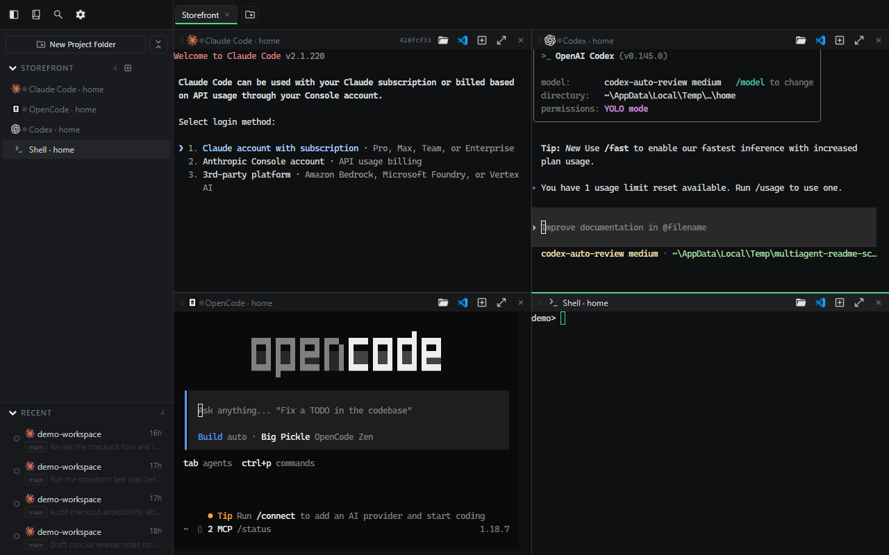
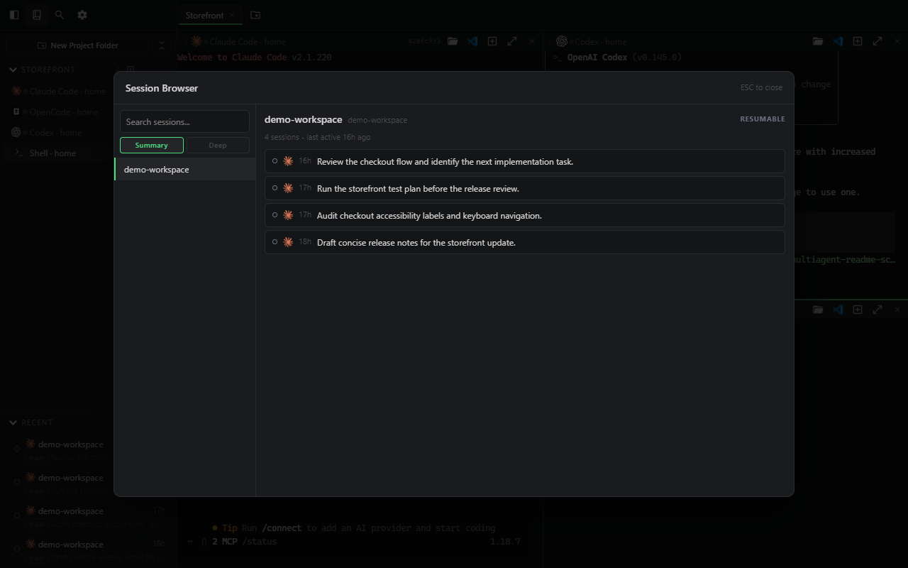
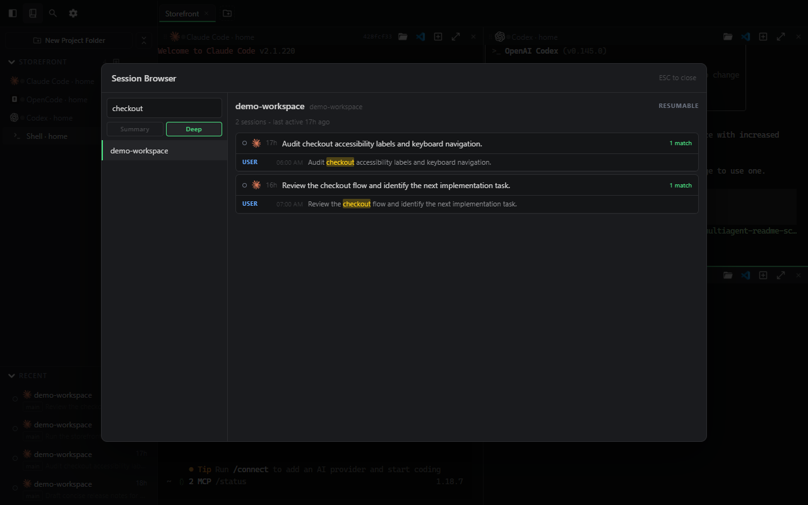
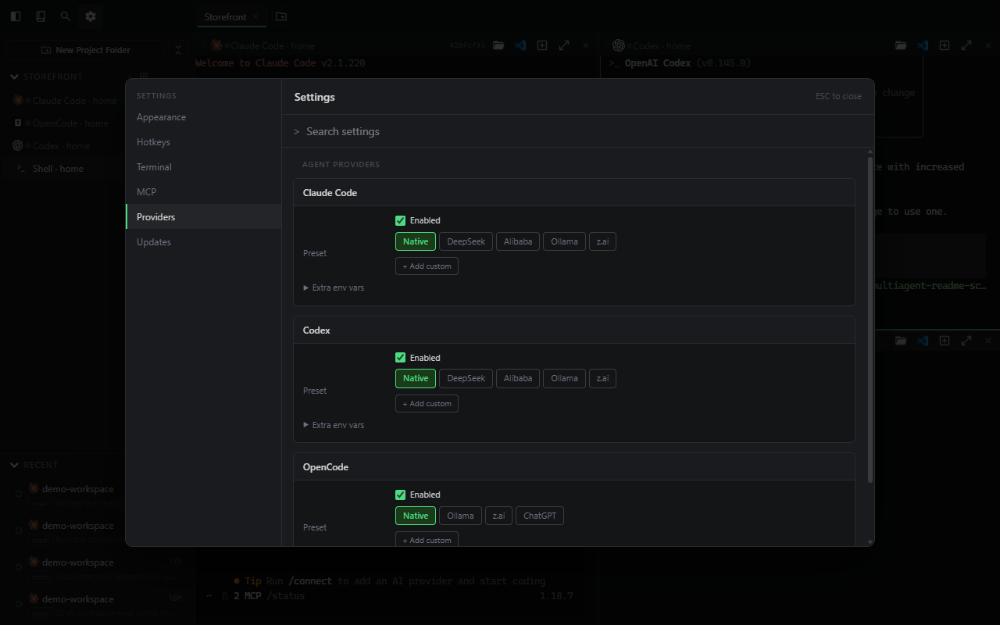
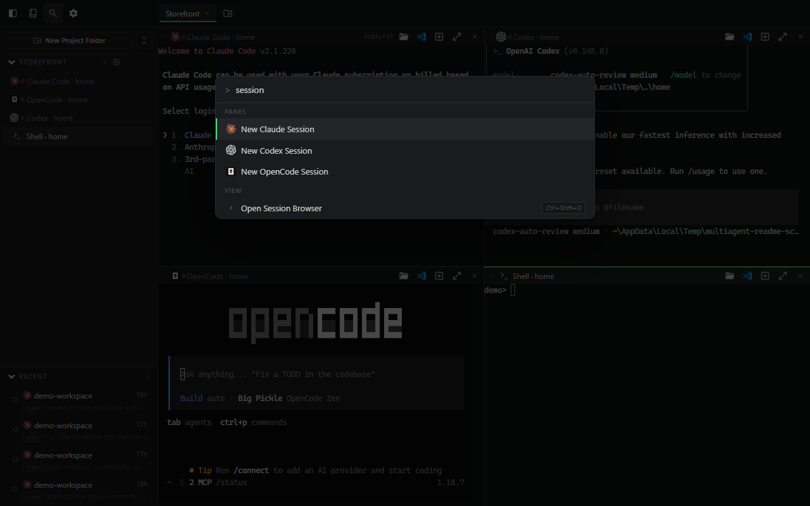
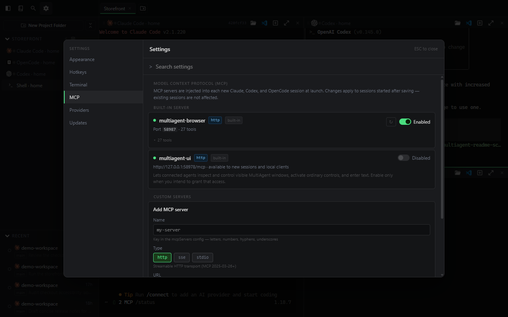

# MultiAgent

MultiAgent is a desktop workspace for running Claude Code, Codex, OpenCode, and regular shell sessions side by side. It combines a tiling terminal, persistent project layouts, searchable agent history, and an embedded browser that agents can control through MCP.

MultiAgent began as a passion project by a single developer building the ideal app for their own workflow. Its purpose is to provide an easy-to-use terminal multiplexer for CLI coding agents, whether they are accessed through a subscription or an API key. It supports Claude Code, Codex, and OpenCode with their native services as well as compatible third-party providers and models such as GLM and Qwen—without locking the workflow into an app-specific AI integration or monetization model.

> [!WARNING]
> MultiAgent is alpha software. Expect breaking changes and rough edges. It runs on Windows 10/11, macOS (Apple Silicon), and Linux. macOS builds are **unsigned** for now (see [Installing on macOS](#installing-on-macos)); Linux AppImage/deb are unsigned.



## Why MultiAgent?

Agent CLIs work well independently, but real projects often need several sessions at once: one agent implementing, another reviewing, a shell running tests, and a browser verifying the result. MultiAgent keeps that work in one durable workspace instead of spreading it across terminal windows.

## Features

- **Three coding-agent CLIs in one app** — start Claude Code, Codex, or OpenCode in any project directory and mix agent and shell (PowerShell, bash, zsh) panes in the same tab. Agents started manually in a shell pane can also be recognized and promoted into the workspace.
- **Flexible tiling layouts** — split panes horizontally or vertically, resize and zoom them, reorder panes and tabs with drag and drop, or move work into a detached window.
- **Persistent workspaces** — tabs, pane trees, directories, sidebar state, and active sessions are restored when the app starts. Inactive tabs are loaded on demand.
- **Resume and search agent sessions** — browse recent Claude, Codex, and OpenCode sessions, filter summaries instantly, or deep-search complete transcripts with literal, case-sensitive, and regex modes.
- **Safe project-directory changes** — pasted project paths are normalized and checked as accessible absolute directories before they replace a tab's default directory; missing projects can also be repaired with a replacement directory.
- **Agent-controlled browser** — open an embedded browser and expose navigation, inspection, interaction, screenshots, JavaScript evaluation, console output, network metadata, and cookie tools to agents through a process-scoped MCP server.
- **Honest agent state** — pane badges show lifecycle state, and an optional narrow terminal-output detector flags supported fatal Codex API errors until the next turn or session event.
- **Command palette and keyboard workflow** — reach workspace actions from `Ctrl+Shift+P`, customize app shortcuts, and create terminal text macros.
- **Provider configuration and availability** — use native settings, built-in provider presets, or saved named custom endpoints. At startup, MultiAgent offers a new agent only when its CLI is on the app's `PATH` and its provider is enabled.
- **Terminal controls** — configure scrollback, rendering, GPU acceleration, contrast, glyph scaling, terminal key bindings, and reusable text macros.
- **Project-aware tools** — open a pane in Explorer or VS Code, copy its path, switch among recent directories, and optionally display Git branch badges.
- **Automatic updates** — packaged builds can check GitHub Releases and install updates from inside the app.

### Session history

| Summary search | Deep transcript search |
| --- | --- |
|  |  |

## Requirements

| Requirement | Notes |
| --- | --- |
| Windows 10/11, macOS (Apple Silicon), or Linux | Windows uses PowerShell + ConPTY; macOS/Linux use bash/zsh + `/proc` or `ps` for agent detection. |
| Node.js 24.x | Required for development builds and native Electron dependencies. The expected version is in `.nvmrc`. |
| Claude Code CLI | Required for Claude panes. Install `claude`, put it on `PATH`, and authenticate before launching MultiAgent. |
| Codex CLI | Required for Codex panes. Install `codex`, put it on `PATH`, and authenticate before launching MultiAgent. |
| OpenCode CLI | Required for OpenCode panes. Install `opencode`, put it on `PATH`, and configure/authenticate it as appropriate for your chosen provider. |
| Native build toolchain | Windows: Visual Studio Build Tools + Python (only if npm can't use prebuilt native modules). macOS: Xcode Command Line Tools. Linux: build-essential + `libudev-dev` (for node-pty). |

You only need the CLI for the agents you intend to use. At startup, unavailable CLIs are disabled and hidden from new-session choices; install the CLI and restart MultiAgent, then enable it in **Settings → Providers**. Shell panes work independently.



## Getting started

Clone and run the app in development mode:

```powershell
git clone https://github.com/itsbreaded/multiagent.git
cd multiagent
npm install
npm run dev
```

Do not install with `--ignore-scripts`. The postinstall step downloads Electron, rebuilds `better-sqlite3` for Electron's ABI, and applies required package patches.

To produce an installer and an unpacked build for your OS:

```bash
npm run dist          # builds for the host OS (NSIS on Windows, dmg+zip on macOS, AppImage+deb on Linux)
```

On Windows the installer is written to `dist\MultiAgent Setup X.Y.Z.exe` and the unpacked app to `dist\win-unpacked\`. On macOS the output is `dist/MultiAgent-X.Y.Z-arm64.dmg` + `.zip`. On Linux it is `dist/MultiAgent-X.Y.Z.AppImage` + `.deb`. (On macOS, generate the icon first with `npm run build:icon` — the CI release workflow does this automatically.)

> [!NOTE]
> Windows Developer Mode must be enabled to package the app without administrator privileges because Electron Builder creates symbolic links. Development mode (`npm run dev`) does not require it.

## Installing a release

Download the latest artifacts from [GitHub Releases](https://github.com/itsbreaded/multiagent/releases):

- **Windows** — `MultiAgent Setup X.Y.Z.exe` (per-user NSIS installer, no admin rights).
- **Linux** — `MultiAgent-X.Y.Z.AppImage` (make executable: `chmod +x` and run) or the `.deb`.

### Installing on macOS

The macOS build is currently **unsigned** (Gatekeeper will warn that the developer cannot be verified). To run it, drag `MultiAgent.app` from the dmg to `/Applications`, then strip the quarantine attribute:

```bash
xattr -cr /Applications/MultiAgent.app
```

Then open it normally (or right-click → Open the first time). A future release will be signed + notarized once an Apple Developer ID is in place, which removes this step. Unsigned updates auto-downloaded by the in-app updater have the same Gatekeeper caveat — re-run `xattr -cr` after an update, or download the dmg directly.

## Basic workflow

1. Create a tab and select a project directory.
2. Start any available Claude, Codex, OpenCode, or shell pane.
3. Split the workspace to add complementary sessions.
4. Use the sidebar to navigate panes and recent sessions.
5. Open the Session Browser to resume or search previous work.
6. Toggle the embedded browser when an agent needs to inspect a web application.

### Command palette

Use `Ctrl+Shift+P` to start an available agent, manage panes and tabs, open settings, or jump to Session Browser.



### Default shortcuts

| Action | Shortcut |
| --- | --- |
| New tab | `Ctrl+T` |
| Close tab | `Ctrl+W` |
| Split vertically | `Ctrl+Shift+E` |
| Split horizontally | `Ctrl+Shift+D` |
| Close pane | `Ctrl+Shift+W` |
| Zoom focused pane | `Ctrl+Shift+Enter` |
| Toggle sidebar | `Ctrl+B` |
| Command palette | `Ctrl+Shift+P` |
| Session Browser | `Ctrl+Shift+O` |

App shortcuts can be changed under **Settings → Hotkeys**. Terminal-specific bindings and text macros live under **Settings → Terminal**.



## Browser MCP: external web content

`multiagent-browser` is the built-in MCP server for the embedded browser. It is separate from application automation: use it when an app-launched Claude, Codex, or OpenCode session needs to work with web content. Agents can navigate pages, click and type, inspect visible content and links, run JavaScript, manage cookies, wait for page state, take screenshots, and read bounded console and network diagnostics.

Browser cookie reads can include cookie values, so treat that MCP result as sensitive. Injection is scoped to the launched process: MultiAgent does not rewrite global or project-level agent configuration, and existing MCP servers remain available.

## Live application automation MCP

Settings → MCP can enable `multiagent-ui`, a separate loopback-only MCP server
that lets an agent inspect and operate visible MultiAgent windows. It can click,
type, scroll, send keys, drag, wait for UI state, take screenshots, and inspect
renderer console and network diagnostics. Enable it only when you intend to
grant that broad control to a local agent.

The server is injected process-scoped into newly launched supported agent
sessions; it does not modify global or project MCP configuration. A local client
can connect directly at `http://127.0.0.1:<port>/mcp`, shown in MCP Settings.
For an explicitly launched development or packaged instance, set
`MULTIAGENT_UI_AUTOMATION_PORT` to a free port. This temporarily opts in that
process and makes the endpoint deterministic, for example:

```powershell
$env:MULTIAGENT_UI_AUTOMATION_PORT='48129'
npm run dev
```

The port must be an available integer from 1 to 65535. An invalid or occupied
requested port leaves automation unavailable and reports the startup error; the
application never substitutes another port. The service listens only on
`127.0.0.1` and uses no remote discovery or network exposure. It has no
per-client authentication or persistent on-screen indicator, so enable it only
for trusted local workflows and disable it when finished.

## Development

```powershell
npm run dev             # Electron + Vite development server
npm run build           # compile without packaging
npm run typecheck       # TypeScript checks
npm test                # unit and component tests
npm run test:coverage   # tests with HTML and LCOV coverage
npm run test:e2e        # build and run Playwright Electron tests
npm run dist            # build the NSIS installer and unpacked app
node scripts/capture-readme-screenshots.mjs  # regenerate synthetic README screenshots
```

### Architecture

MultiAgent uses Electron, React, Zustand, xterm.js, and node-pty:

- The **main process** owns PTYs, session indexing, persistence, updates, detached windows, and the embedded browser.
- The **preload bridge** exposes typed IPC channels to the UI.
- The **renderer** manages tabs and tiling pane trees, renders terminals, and provides the workspace UI.
- A dedicated **PTY worker process** isolates Windows ConPTY from Chromium IPC handles.
- A local **SQLite FTS5 index** provides fast session metadata search; deep search reads Claude/Codex transcripts and OpenCode session data.

See [CLAUDE.md](./CLAUDE.md) for detailed contributor notes and the completed specs in [`specs/done`](./specs/done) for design history.

## Troubleshooting

- **An agent is not offered for a new pane:** Confirm the relevant `claude`, `codex`, or `opencode` executable is on the `PATH` inherited by MultiAgent, restart the app, and enable it under **Settings → Providers**.
- **Electron is missing after install:** Run `node node_modules/electron/install.js`, or rerun `npm install` without `--ignore-scripts`.
- **`better-sqlite3` fails to rebuild:** Verify `node -v` reports Node 24.x. Install Visual Studio Build Tools and Python only if no compatible prebuild is available.
- **Packaging fails with a symlink or `EPERM` error:** Enable **Settings → System → For developers → Developer Mode** in Windows.

## Project status

MultiAgent is under active development. Bug reports and focused pull requests are welcome; include your Windows version, Node version, affected agent CLI, and reproduction steps when reporting a problem.

## License

MIT
